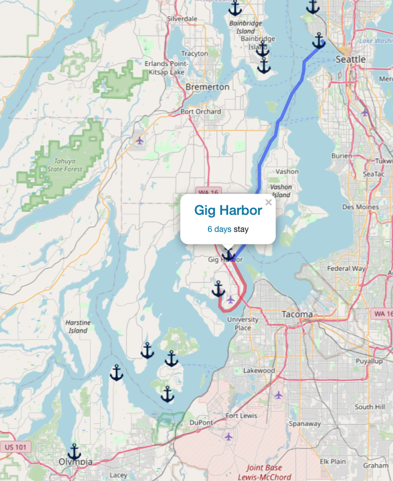

# Saillogger
Saillogger effortlessly logs your sails, automatically capturing your moorages, dockings and anchorages with no additional effort. 

## Features
* Automatically log your sails without manually starting, stopping a trip
* Automatically capture your stays and details of them
* Add custom notes to logs, stays and moorages
* Export and download your logs
* Aggregate your sailing statistics: Longest sails, time spent at anchorages, home ports etc.
* See your moorages on a global map, with incoming and outgoing sails from each 
* (For US waters) Layer NOAA raster charts on the map

Requires a free account on [saillogger.com](https://saillogger.com).

## Screenshots

  
  
  
  
  

