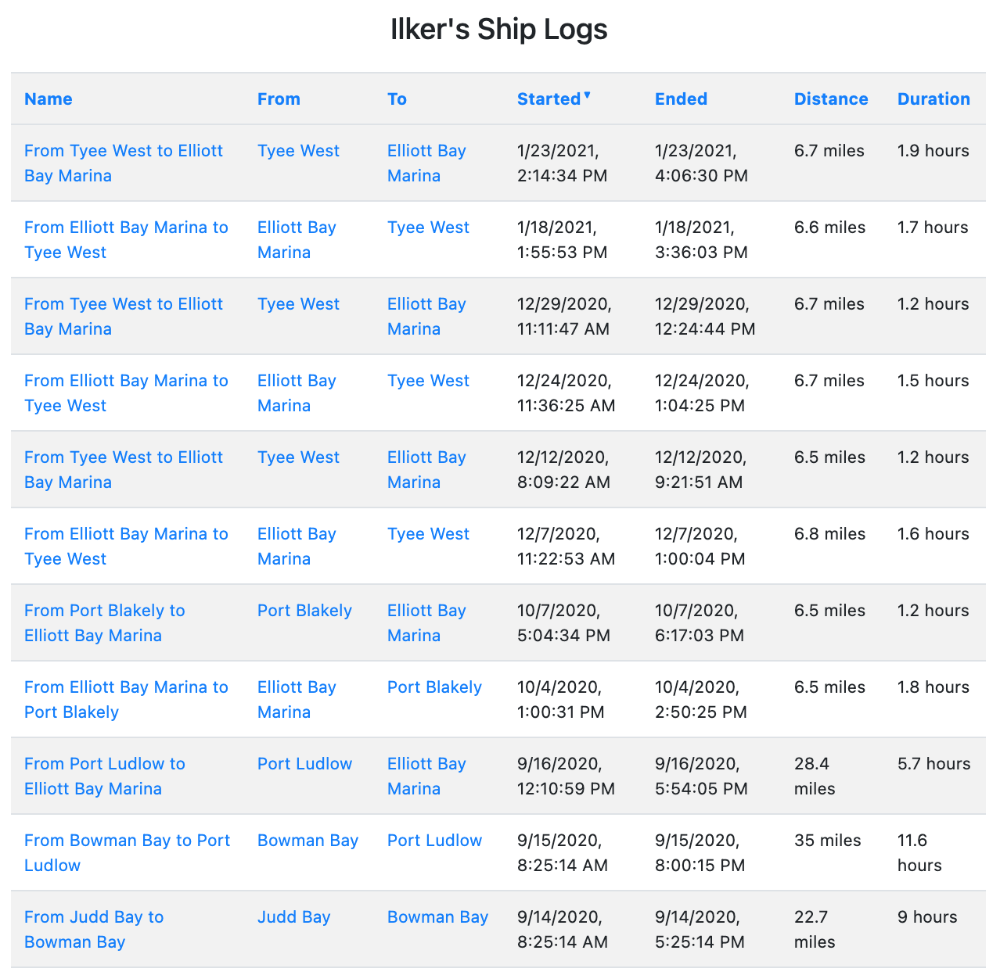
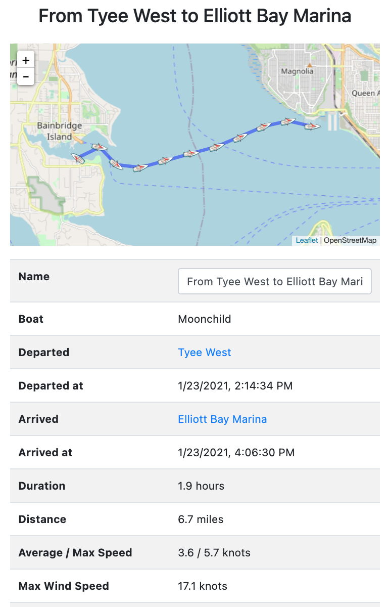
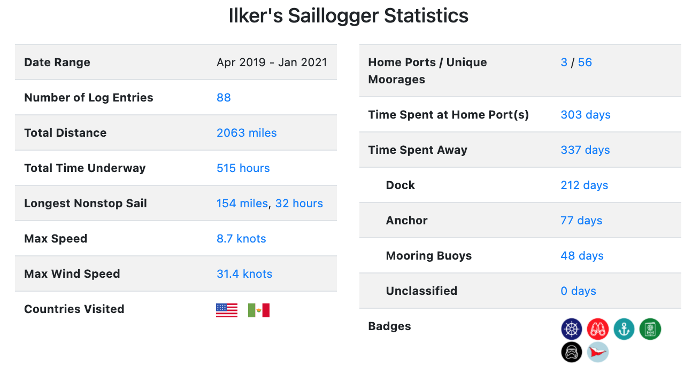
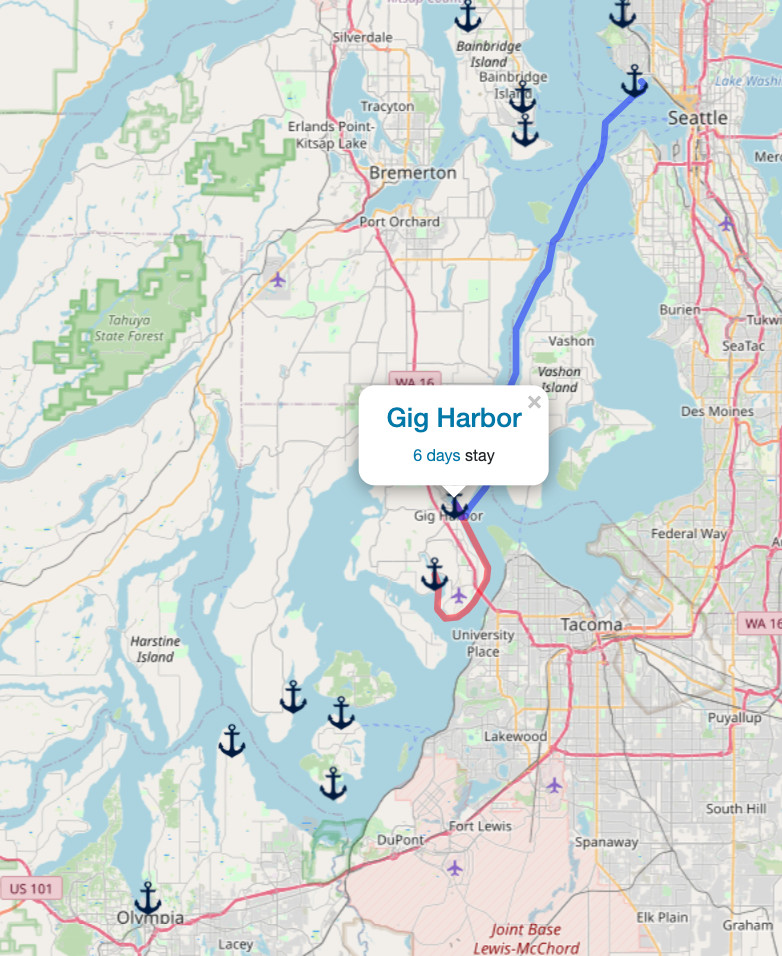
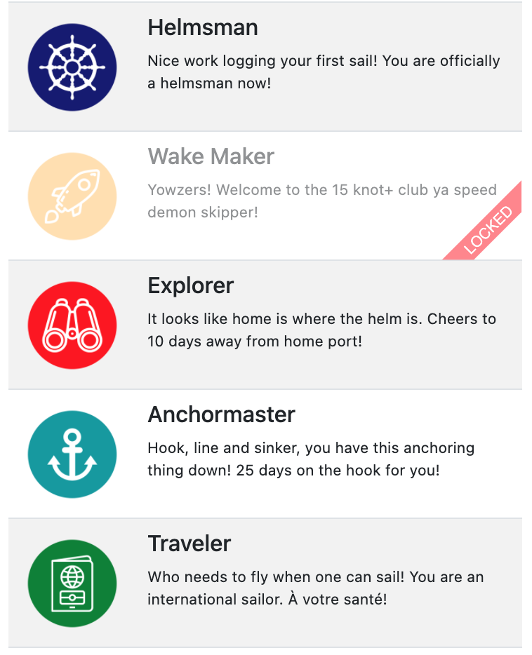
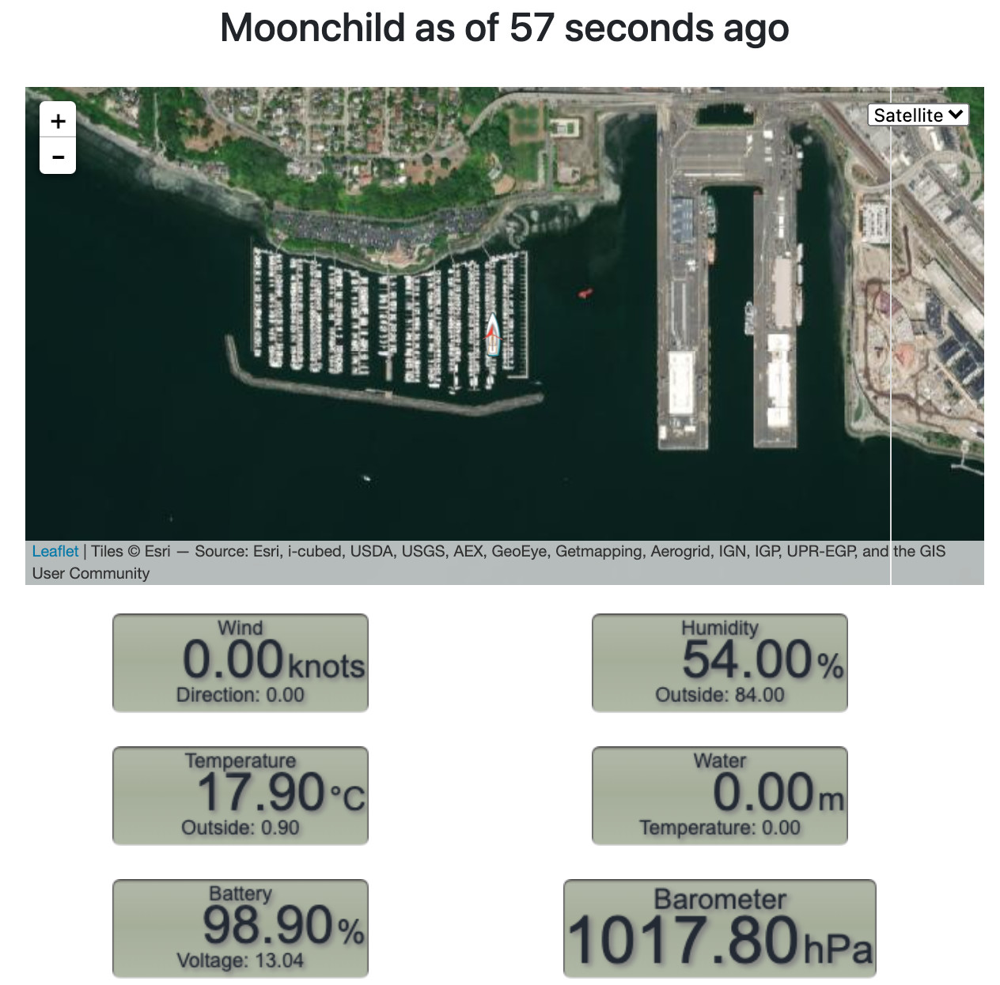

# Saillogger
Saillogger effortlessly logs your voyages, automatically capturing your trips, moorages, dockings and anchorages with no additional need to stop/start anything.  Built for sailors, motorboats and commercial uses.

## Features
* Automatically log your voyages without manually starting or stopping a trip ([See demo](https://saillogger.com/log/573))
* Automatically capture the details of your voyages (boat speed, heading, wind speed, etc)
* Timelapse video your trips!  ([See demo](https://saillogger.com/timelapse/2/))
* Add custom notes to your logs
* Export and download your logs
* Aggregate your trip statistics: Longest voyage, time spent at anchorages, home ports etc. ([See demo](https://saillogger.com/stats/2/))
* See your moorages on a global map, with incoming and outgoing voyages from each
* (For US waters) Layer NOAA raster charts on the map
* Monitor your boat (position, depth, wind, temperature, battery charge status, etc.)  remotely (experimental)

Requires a free account on [saillogger.com](https://saillogger.com).

## Screenshots

  
  
  
  
  
  

